# CloudPaste - Online Clipboard 📋

<div align="center">
    <p>
    <a href="README.md">中文</a> | <a href="README_EN.md">English</a>
    </p>
    
    <h3>Cloudflare-based online clipboard and file sharing service with Markdown editing and file upload support</h3>
</div>

<p align="center">
  <a href="#-showcase">📸 Showcase</a> •
  <a href="#-features">✨ Features</a> •
  <a href="#-deployment-guide">🚀 Deployment Guide</a> •
  <a href="#-tech-stack">🔧 Tech Stack</a> •
  <a href="#-development">💻 Development</a> •
  <a href="#-license">📄 License</a>
</p>

## 📸 Showcase

<table align="center">
  <tr>
    <td>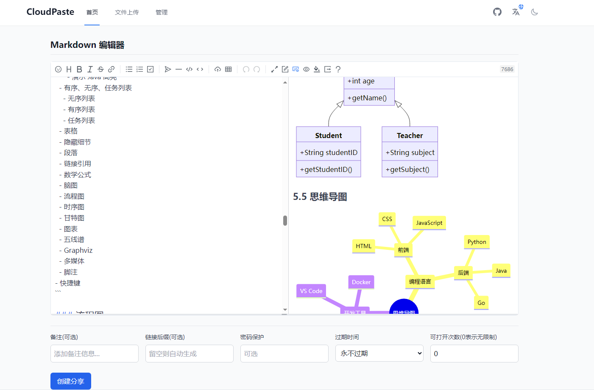</td>
    <td>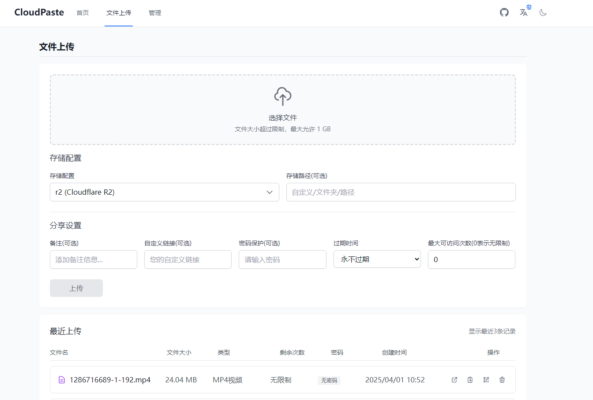</td>
  </tr>
  <tr>
    <td>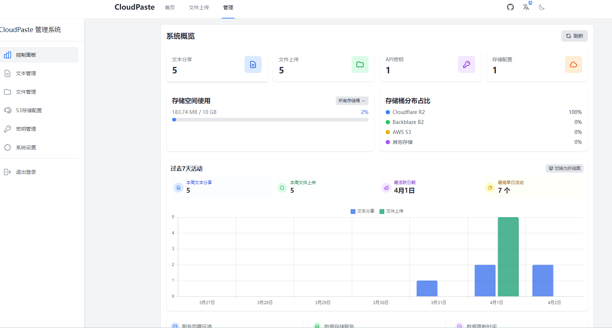</td>
    <td>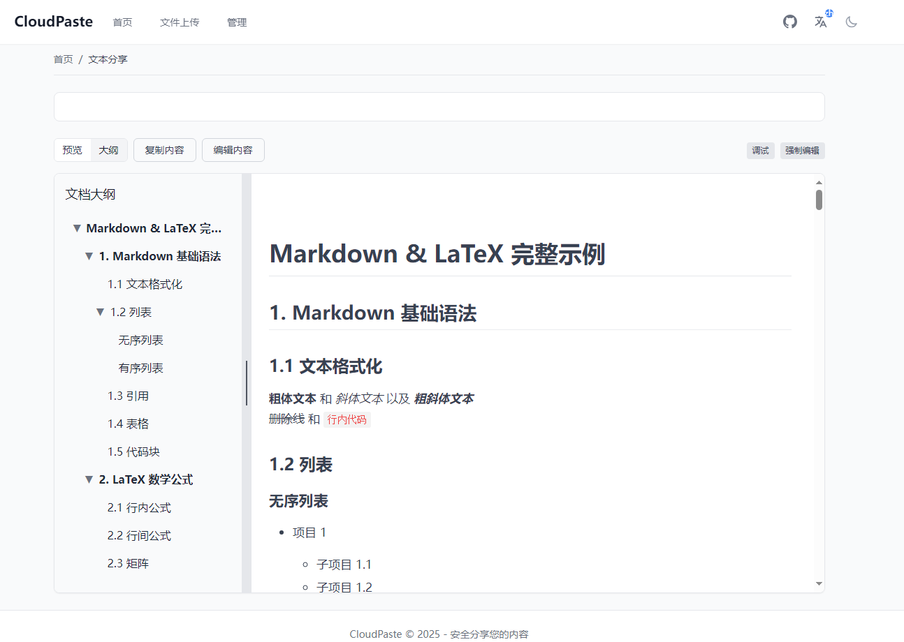</td>
  </tr>
  <tr>
    <td>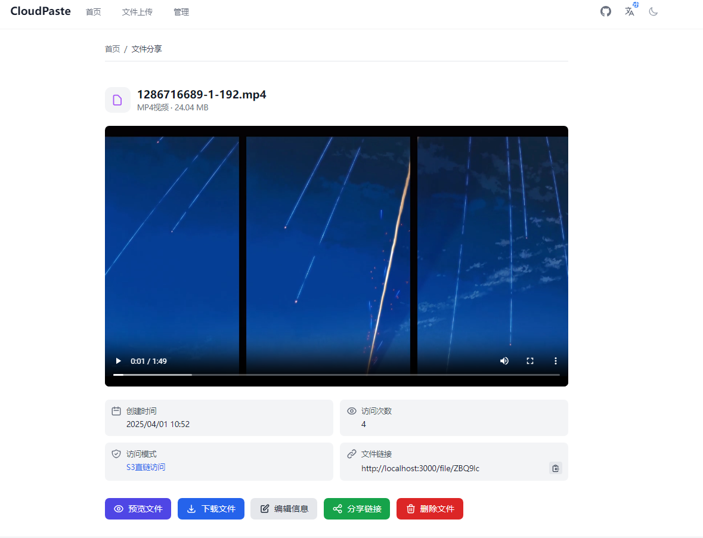</td>
    <td>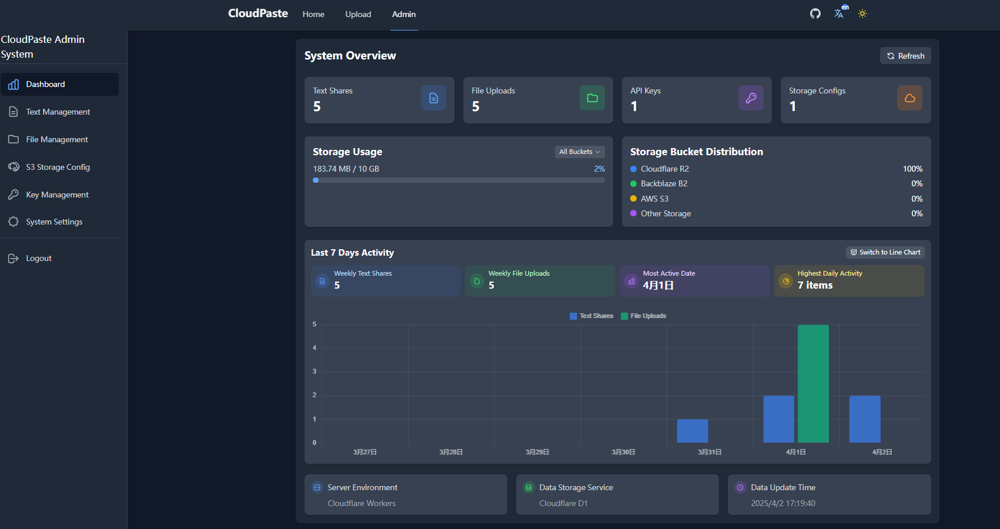</td>
  </tr>
</table>

## ✨ Features

### 📝 Markdown Editing and Sharing

- **Powerful Editor**: Integrated with [Vditor](https://github.com/Vanessa219/vditor), supporting GitHub-flavored Markdown, math formulas, flowcharts, mind maps, and more
- **Secure Sharing**: Content can be protected with access passwords
- **Flexible Expiration**: Support for setting content expiration times
- **Access Control**: Ability to limit maximum view count
- **Customization**: Personalized share links and notes
- **Support for Raw text direct links**: Similar to GitHub's Raw direct links, used for services launched via YAML configuration files
- **Multi-format export**: Supports export to PDF, Markdown, HTML, PNG images, and Word documents
- **Easy Sharing**: One-click link copying and QR code generation
- **Auto-save**: Support for automatic draft saving

### 📤 File Upload and Management

- **Multiple Storage Support**: Compatible with various S3 storage services (Cloudflare R2, Backblaze B2, AWS S3, etc.)
- **Storage Configuration**: Visual interface for configuring multiple storage spaces, flexible switching of default storage sources
- **Efficient Upload**: Direct upload to S3 storage via presigned URLs
- **Real-time Feedback**: Real-time upload progress display
- **Custom Limits**: Single upload limits and maximum capacity restrictions
- **Metadata Management**: File notes, passwords, expiration times, access restrictions
- **Data Analysis**: File access statistics and trend analysis
- **Direct Server Transfer**: Supports calling APIs for file upload, download, and other operations.

### 🛠 Convenient File/Text Operations

- **Unified Management**: Support for file/text creation, deletion, and property modification
- **Online Preview**: Online preview and direct link generation for common documents, images, and media files
- **Sharing Tools**: Generation of short links and QR codes for cross-platform sharing
- **Batch Management**: Batch operations and display for files/text

### 🔄 WebDAV and Mount Point Management

- **WebDAV Protocol Support**: Access and manage the file system via standard WebDAV protocol
- **Network Drive Mounting**: Support for mounting by some third-party clients
- **Flexible Mount Points**: Support for creating multiple mount points connected to different storage services
- **Permission Control**: Fine-grained mount point access permission management
- **API Key Integration**: WebDAV access authorization through API keys
- **Large File Support**: Automatic use of multipart upload mechanism for large files
- **Directory Operations**: Full support for directory creation, upload, deletion, renaming, and other operations

### 🔐 Lightweight Permission Management

#### Administrator Permission Control

- **System Management**: Global system settings configuration
- **Content Moderation**: Management of all user content
- **Storage Management**: Addition, editing, and deletion of S3 storage services
- **Permission Assignment**: Creation and permission management of API keys
- **Data Analysis**: Complete access to statistical data

#### API Key Permission Control

- **Text Permissions**: Create/edit/delete text content
- **File Permissions**: Upload/manage/delete files
- **Storage Permissions**: Ability to select specific storage configurations
- **Read/Write Separation**: Can set read-only or read-write permissions
- **Time Control**: Custom validity period (from hours to months)
- **Security Mechanism**: Automatic expiration and manual revocation functions

### 💫 System Features

- **High Adaptability**: Responsive design, adapting to mobile devices and desktops
- **Multilingual**: Chinese/English bilingual interface support
- **Visual Modes**: Bright/dark theme switching
- **Secure Authentication**: JWT-based administrator authentication system
- **Offline Experience**: PWA support, allowing offline use and desktop installation

## 🚀 Deployment Guide

### Prerequisites

Before starting deployment, please ensure you have prepared the following:

- [ ] [Cloudflare](https://dash.cloudflare.com) account (required)
- [ ] If using R2: Activate **Cloudflare R2** service and create a bucket (requires payment method)
- [ ] If using Vercel: Register for a [Vercel](https://vercel.com) account
- [ ] Configuration information for other S3 storage services:
   - `S3_ACCESS_KEY_ID`
   - `S3_SECRET_ACCESS_KEY`
   - `S3_BUCKET_NAME`
   - `S3_ENDPOINT`

<details>
<summary><b>👉 View Complete Deployment Guide</b></summary>

### 📑 Table of Contents

- [Action Automated Deployment](#Action-Automated-Deployment)
   - [Backend Automated Deployment](#Backend-Automated-Deployment)
   - [Frontend Automated Deployment](#Frontend-Automated-Deployment)
- [Manual Deployment](#Manual-Deployment)
   - [Backend Manual Deployment](#Backend-Manual-Deployment)
   - [Frontend Manual Deployment](#Frontend-Manual-Deployment)

---

## Action Automated Deployment

Using GitHub Actions enables automatic deployment of the application after code is pushed.

### Configure GitHub Repository

1. Fork or clone the repository [https://github.com/ling-drag0n/CloudPaste](https://github.com/ling-drag0n/CloudPaste)
2. Go to your GitHub repository settings
3. Navigate to Settings → Secrets and variables → Actions → New Repository secrets
4. Add the following Secrets:

| Secret Name             | Required | Purpose                                                                                  |
| ----------------------- | -------- | ---------------------------------------------------------------------------------------- |
| `CLOUDFLARE_API_TOKEN`  | ✅       | Cloudflare API token (requires Workers, D1, and Pages permissions)                       |
| `CLOUDFLARE_ACCOUNT_ID` | ✅       | Cloudflare account ID                                                                    |
| `ENCRYPTION_SECRET`     | ❌       | Key for encrypting sensitive data (if not provided, one will be automatically generated) |

#### Obtain Cloudflare API Token

1. Visit [Cloudflare Dashboard](https://dash.cloudflare.com/profile/api-tokens)
2. Create a new API token
3. Select the "Edit Cloudflare Workers" template, and add D1 database edit permission

### Backend Automated Deployment

Fork the repository, fill in the secrets, and then run the workflow!!!
Deployment is automatically triggered whenever files in the `backend` directory are changed and pushed to the `main` or `master` branch. The workflow proceeds as follows:

1. **Automatically create D1 database** (if it doesn't exist)
2. **Initialize database with schema.sql** (create tables and initial data)
3. **Set ENCRYPTION_SECRET environment variable** (obtained from GitHub Secrets or automatically generated)
4. Automatically deploy Worker to Cloudflare
5. It is recommended to set up a custom domain to replace the original Cloudflare domain (otherwise it may not be accessible in certain regions)

**<span style="color:red">⚠️ Remember your backend domain name</span>**

### Frontend Automated Deployment

#### Cloudflare Pages (Recommended)

Fork the repository, fill in the secrets, and then run the workflow.
Deployment is automatically triggered whenever files in the `frontend` directory are changed and pushed to the `main` or `master` branch. After deployment, you need to set environment variables in the Cloudflare Pages control panel:

1. Log in to [Cloudflare Dashboard](https://dash.cloudflare.com/)
2. Navigate to Pages → Your project (e.g., "cloudpaste-frontend")
3. Click "Settings" → "Environment variables"
4. Add environment variable:

   - Name: `VITE_BACKEND_URL`
   - Value: Your backend Worker URL (e.g., `https://cloudpaste-backend.your-username.workers.dev`) without trailing "/". It is recommended to use a custom worker backend domain.

   - **<span style="color:red">Make sure to enter the complete backend domain name in "https://xxxx.com" format</span>**

5. Important step: Then run the frontend workflow again to complete loading the backend domain!!!

   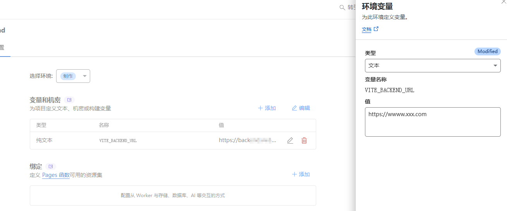

**<span style="color:red">Please follow the steps strictly, otherwise the backend domain loading will fail</span>**

#### Vercel

For Vercel, it's recommended to deploy as follows:

1. Import your GitHub project after forking
2. Configure deployment parameters:

```
Framework Preset: Vite
Build Command: npm run build
Output Directory: dist
Install Command: npm install
```

3. Configure the environment variables below: Enter: VITE_BACKEND_URL and your backend domain
4. Click the "Deploy" button to deploy

☝️ **Choose one of the above methods**

---

## Manual Deployment

### Backend Manual Deployment

1. Clone the repository

```bash
git clone https://github.com/ling-drag0n/CloudPaste.git
cd CloudPaste/backend
```

2. Install dependencies

   ```bash
   npm install
   ```

3. Log in to Cloudflare

   ```bash
   npx wrangler login
   ```

4. Create D1 database

   ```bash
   npx wrangler d1 create cloudpaste-db
   ```

   Note the database ID from the output.

5. Modify wrangler.toml configuration

   ```toml
   [[d1_databases]]
   binding = "DB"
   database_name = "cloudpaste-db"
   database_id = "YOUR_DATABASE_ID"
   ```

6. Deploy Worker

   ```bash
   npx wrangler deploy
   ```

   Note the URL from the output; this is your backend API address.

7. Initialize database (automatic)
   Visit your Worker URL to trigger initialization:

   ```
   https://cloudpaste-backend.your-username.workers.dev
   ```

**<span style="color:red">⚠️ Security reminder: Please change the default administrator password immediately after system initialization (Username: admin, Password: admin123).</span>**

### Frontend Manual Deployment

#### Cloudflare Pages

1. Prepare frontend code

   ```bash
   cd CloudPaste/frontend
   npm install
   ```

2. Configure environment variables
   Create or modify the `.env.production` file:

   ```
   VITE_BACKEND_URL=https://cloudpaste-backend.your-username.workers.dev
   VITE_APP_ENV=production
   VITE_ENABLE_DEVTOOLS=false
   ```

3. Build frontend project

   ```bash
   npm run build
   ```

4. Deploy to Cloudflare Pages

   **Method 1**: Via Wrangler CLI

   ```bash
   npx wrangler pages deploy dist --project-name=cloudpaste-frontend
   ```

   **Method 2**: Via Cloudflare Dashboard

   1. Log in to [Cloudflare Dashboard](https://dash.cloudflare.com/)
   2. Select "Pages"
   3. Click "Create a project" → "Direct Upload"
   4. Upload files from the `dist` directory
   5. Set project name (e.g., "cloudpaste-frontend")
   6. Click "Save and Deploy"

#### Vercel

1. Prepare frontend code

   ```bash
   cd CloudPaste/frontend
   npm install
   ```

2. Install and log in to Vercel CLI

   ```bash
   npm install -g vercel
   vercel login
   ```

3. Configure environment variables, same as for Cloudflare Pages
4. Build and deploy

   ```bash
   vercel --prod
   ```

   Follow the prompts to configure the project.

</details>

<details>
<summary><b>👉 Docker Deployment Guide</b></summary>

### 📑 Table of Contents

- [Docker Command Line Deployment](#Docker-Command-Line-Deployment)
   - [Backend Docker Deployment](#Backend-Docker-Deployment)
   - [Frontend Docker Deployment](#Frontend-Docker-Deployment)
- [Docker Compose One-Click Deployment](#Docker-Compose-One-Click-Deployment)

---

## Docker Command Line Deployment

### Backend Docker Deployment

CloudPaste backend can be quickly deployed using the official Docker image.

1. Create data storage directory

   ```bash
   mkdir -p sql_data
   ```

2. Run the backend container

   ```bash
   docker run -d --name cloudpaste-backend \
     -p 8787:8787 \
     -v $(pwd)/sql_data:/data \
     -e ENCRYPTION_SECRET=your-encryption-key \
     -e NODE_ENV=production \
     -e RUNTIME_ENV=docker \
     dragon730/cloudpaste-backend:latest
   ```

   Note the deployment URL (e.g., `http://your-server-ip:8787`), which will be needed for the frontend deployment.

**<span style="color:red">⚠️ Security tip: Be sure to customize ENCRYPTION_SECRET and keep it safe, as this key is used to encrypt sensitive data.</span>**

### Frontend Docker Deployment

The frontend uses Nginx to serve and configures the backend API address at startup.

```bash
docker run -d --name cloudpaste-frontend \
  -p 80:80 \
  -e BACKEND_URL=http://your-server-ip:8787 \
  dragon730/cloudpaste-frontend:latest
```

**<span style="color:red">⚠️ Note: BACKEND_URL must include the complete URL (including protocol http:// or https://)</span>**
**<span style="color:red">⚠️ Security reminder: Please change the default administrator password immediately after system initialization (Username: admin, Password: admin123).</span>**

### Docker Image Update

When a new version of the project is released, you can update your Docker deployment following these steps:

1. Pull the latest images

   ```bash
   docker pull dragon730/cloudpaste-backend:latest
   docker pull dragon730/cloudpaste-frontend:latest
   ```

2. Stop and remove old containers

   ```bash
   docker stop cloudpaste-backend cloudpaste-frontend
   docker rm cloudpaste-backend cloudpaste-frontend
   ```

3. Start new containers using the same run commands as above (preserving data directory and configuration)

## Docker Compose One-Click Deployment

Using Docker Compose allows you to deploy both frontend and backend services with one click, which is the simplest recommended method.

1. Create a `docker-compose.yml` file

```yaml
version: "3.8"

services:
  frontend:
    image: dragon730/cloudpaste-frontend:latest
    environment:
      - BACKEND_URL=https://xxx.com # Fill in the backend service address
    ports:
      - "8080:80" #"127.0.0.1:8080:80"
    depends_on:
      - backend # Depends on backend service
    networks:
      - cloudpaste-network
    restart: unless-stopped

  backend:
    image: dragon730/cloudpaste-backend:latest
    environment:
      - NODE_ENV=production
      - RUNTIME_ENV=docker
      - PORT=8787
      - ENCRYPTION_SECRET=custom-key # Please modify this to your own security key
    volumes:
      - ./sql_data:/data # Data persistence
    ports:
      - "8787:8787" #"127.0.0.1:8787:8787"
    networks:
      - cloudpaste-network
    restart: unless-stopped

networks:
  cloudpaste-network:
    driver: bridge
```

2. Start the services

```bash
docker-compose up -d
```

**<span style="color:red">⚠️ Security reminder: Please change the default administrator password immediately after system initialization (Username: admin, Password: admin123).</span>**

3. Access the services

Frontend: `http://your-server-ip:80`
Backend: `http://your-server-ip:8787`

### Docker Compose Update

When you need to update to a new version:

1. Pull the latest images

   ```bash
   docker-compose pull
   ```

2. Recreate containers using new images (preserving data volumes)

   ```bash
   docker-compose up -d --force-recreate
   ```

**<span style="color:orange">💡 Tip: If there are configuration changes, you may need to backup data and modify the docker-compose.yml file</span>**

### Nginx Reverse Proxy Example

```nginx
server {
    listen 443 ssl;
    server_name paste.yourdomain.com;  # Replace with your domain name

    # SSL certificate configuration
    ssl_certificate     /path/to/cert.pem;  # Replace with certificate path
    ssl_certificate_key /path/to/key.pem;   # Replace with key path

    # Frontend proxy configuration
    location / {
        proxy_pass http://localhost:80;  # Docker frontend service address
        proxy_set_header Host $host;
        proxy_set_header X-Real-IP $remote_addr;
    }

    # Backend API proxy configuration
    location /api {
        proxy_pass http://localhost:8787;  # Docker backend service address
        proxy_set_header Host $host;
        proxy_set_header X-Real-IP $remote_addr;

        # WebSocket support (if needed)
        proxy_http_version 1.1;
        proxy_set_header Upgrade $http_upgrade;
        proxy_set_header Connection "upgrade";
    }

    # WebDAV Configuration
    location /dav {
        proxy_pass http://localhost:8787/dav;  # Points to your backend service

        # WebDAV necessary headers
        proxy_set_header Host $host;
        proxy_set_header X-Real-IP $remote_addr;
        proxy_set_header X-Forwarded-For $proxy_add_x_forwarded_for;

        # WebDAV method support
        proxy_pass_request_headers on;

        # Support all WebDAV methods
        proxy_method $request_method;

        # Necessary header processing
        proxy_set_header Destination $http_destination;
        proxy_set_header Overwrite $http_overwrite;

        # Handle large files
        client_max_body_size 0;

        # Timeout settings
        proxy_connect_timeout 3600s;
        proxy_send_timeout 3600s;
        proxy_read_timeout 3600s;
    }
}
```

**<span style="color:red">⚠️ Security tip: It is recommended to configure HTTPS and a reverse proxy (such as Nginx) to enhance security.</span>**

</details>

<details>
<summary><b>👉 S3 Cross-Origin Configuration Guide</b></summary>

## R2 API Retrieval and Cross-Origin Configuration

1. Log in to Cloudflare Dashboard
2. Click R2 Storage and create a bucket.
3. Create API token
   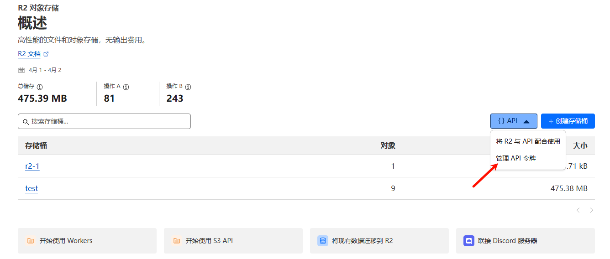
   

4. Save all data after creation; you'll need it later
5. Configure cross-origin rules: click the corresponding bucket, click Settings, edit CORS policy as shown below:

```json
[
  {
    "AllowedOrigins": ["http://localhost:3000", "https://replace-with-your-frontend-domain"],
    "AllowedMethods": ["GET", "PUT", "POST", "DELETE", "HEAD"],
    "AllowedHeaders": ["*"],
    "ExposeHeaders": ["ETag"],
    "MaxAgeSeconds": 3600
  }
]
```

## B2 API Retrieval and Cross-Origin Configuration

1. If you don't have a B2 account, [register](https://www.backblaze.com/sign-up/cloud-storage?referrer=getstarted) one first, then create a bucket.
   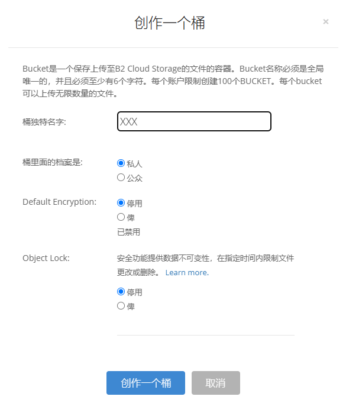
2. Click Application Key in the sidebar, click Create Key, and follow the illustration.
   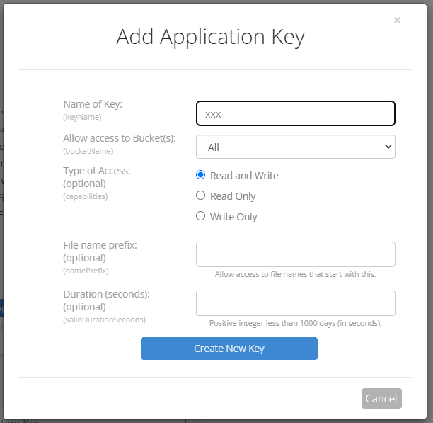
3. Configure B2 cross-origin; B2 cross-origin configuration is more complex, take note
   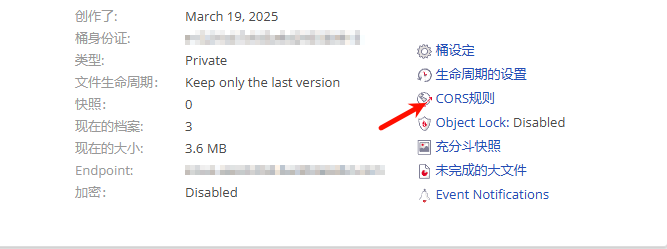
4. You can try options 1 or 2 first, go to the upload page and see if you can upload. If F12 console shows cross-origin errors, use option 3. For a permanent solution, use option 3 directly.

   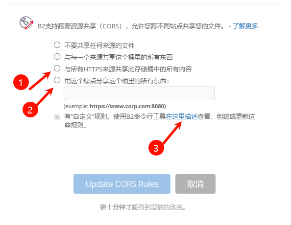

Regarding option 3 configuration, since the panel cannot configure it, you need to configure manually by [downloading B2 CLI](https://www.backblaze.com/docs/cloud-storage-command-line-tools) tool. For more details, refer to: "https://docs.cloudreve.org/use/policy/s3#backblaze-b2".

After downloading, in the corresponding download directory CMD, enter the following commands:

```txt
b2.exe account authorize   //Log in to your account, following prompts to enter your keyID and applicationKey
b2.exe bucket get <bucketName> //You can execute to get bucket information, replace <bucketName> with your bucket name
```

Windows configuration, Use ".\b2-windows.exe xxx", 
Python CLI would be similar:

```cmd
b2.exe bucket update <bucketName> allPrivate --cors-rules "[{\"corsRuleName\":\"CloudPaste\",\"allowedOrigins\":[\"*\"],\"allowedHeaders\":[\"*\"],\"allowedOperations\":[\"b2_upload_file\",\"b2_download_file_by_name\",\"b2_download_file_by_id\",\"s3_head\",\"s3_get\",\"s3_put\",\"s3_post\",\"s3_delete\"],\"exposeHeaders\":[\"Etag\",\"content-length\",\"content-type\",\"x-bz-content-sha1\"],\"maxAgeSeconds\":3600}]"
```

Replace <bucketName> with your bucket name. For allowedOrigins in the cross-origin allowance, you can configure based on your needs; here it allows all.

5. Cross-origin configuration complete

## More S3-related configurations to come......

</details>

<details>
<summary><b>👉 WebDAV Configuration Guide</b></summary>

## WebDAV Configuration and Usage Guide

CloudPaste provides simple WebDAV protocol support, allowing you to mount storage spaces as network drives for convenient access and management of files directly through file managers.

### WebDAV Service Basic Information

- **WebDAV Base URL**: `https://your-backend-domain/dav`
- **Supported Authentication Methods**:
   - Basic Authentication (username+password)
- **Supported Permission Types**:
   - Administrator accounts - Full operation permissions
   - API keys - Requires enabled mount permission (mount_permission)

### Permission Configuration

#### 1. Administrator Account Access

Use administrator account and password to directly access the WebDAV service:

- **Username**: Administrator username
- **Password**: Administrator password

#### 2. API Key Access (Recommended)

For a more secure access method, it is recommended to create a dedicated API key:

1. Log in to the management interface
2. Navigate to "API Key Management"
3. Create a new API key, **ensure "Mount Permission" is enabled**
4. Usage method:
   - **Username**: API key value
   - **Password**: The same API key value as the username

### NGINX Reverse Proxy Configuration

If using NGINX as a reverse proxy, specific WebDAV configuration needs to be added to ensure all WebDAV methods work properly:

```nginx
# WebDAV Configuration
location /dav {
    proxy_pass http://localhost:8787;  # Points to your backend service

    # WebDAV necessary headers
    proxy_set_header Host $host;
    proxy_set_header X-Real-IP $remote_addr;
    proxy_set_header X-Forwarded-For $proxy_add_x_forwarded_for;

    # WebDAV method support
    proxy_pass_request_headers on;

    # Support all WebDAV methods
    proxy_method $request_method;

    # Necessary header processing
    proxy_set_header Destination $http_destination;
    proxy_set_header Overwrite $http_overwrite;

    # Handle large files
    client_max_body_size 0;

    # Timeout settings
    proxy_connect_timeout 3600s;
    proxy_send_timeout 3600s;
    proxy_read_timeout 3600s;
}
```

### Common Issues and Solutions

1. **Connection Problems**:

   - Confirm the WebDAV URL format is correct
   - Verify that authentication credentials are valid
   - Check if the API key has mount permission

2. **Permission Errors**:

   - Confirm the account has the required permissions
   - Administrator accounts should have full permissions
   - API keys need to have mount permission specifically enabled

3. **⚠️⚠️ WebDAV Upload Issues**:

   - In presigned upload mode, attention needs to be paid to the cross-origin configuration of the corresponding S3 storage
   - In WebDAV's automatic recommendation mode, files smaller than 10MB use direct upload mode, files between 10-50MB use multipart upload mode, and files larger than 50MB use presigned upload mode
   - Regarding Cloudflare Worker upload limitations, it is recommended to use presigned or direct upload mode, and avoid using multipart uploads
   - For Docker deployments, just pay attention to the nginx proxy configuration, any upload mode is acceptable
   - Windows, Raidrive and other clients do not yet support drag-and-drop uploads, everything else works

</details>

## 🔧 Tech Stack

### Frontend

- **Framework**: Vue.js 3 + Vite
- **Styling**: TailwindCSS
- **Editor**: Vditor
- **Internationalization**: Vue-i18n
- **Charts**: Chart.js + Vue-chartjs

### Backend

- **Runtime**: Cloudflare Workers
- **Framework**: Hono
- **Database**: Cloudflare D1 (SQLite)
- **Storage**: Multiple S3-compatible services (supports R2, B2, AWS S3)
- **Authentication**: JWT tokens + API keys

## 💻 Development

### API Documentation

[API Documentation](Api-doc.md)

[Server Direct File Upload API Documentation](Api-s3_direct.md) - Detailed description of the server direct file upload interface

### Local Development Setup

1. **Clone project repository**

   ```bash
   git clone https://github.com/ling-drag0n/cloudpaste.git
   cd cloudpaste
   ```

2. **Backend setup**

   ```bash
   cd backend
   npm install
   # Initialize D1 database
   wrangler d1 create cloudpaste-db
   wrangler d1 execute cloudpaste-db --file=./schema.sql
   ```

3. **Frontend setup**

   ```bash
   cd frontend
   npm install
   ```

4. **Configure environment variables**

   - In the `backend` directory, create a `wrangler.toml` file to set development environment variables
   - In the `frontend` directory, configure the `.env.development` file to set frontend environment variables

5. **Start development servers**

   ```bash
   # Backend
   cd backend
   npm run dev

   # Frontend (in another terminal)
   cd frontend
   npm run dev
   ```

### Project Structure

```
CloudPaste/
├── frontend/                # Frontend Vue.js application
│   ├── src/                 # Source code
│   │   ├── components/      # Vue components
│   │   ├── api/             # API clients and services
│   │   ├── i18n/            # Internationalization resource files
│   │   ├── utils/           # Utility functions
│   │   └── assets/          # Static assets
│   └── ...
└── backend/                 # Cloudflare Workers backend
    ├── worker.js            # Main Worker file
    ├── schema.sql           # D1 database schema
    └── ...
```

### Custom Docker Build

If you want to customize Docker images or debug during development, you can follow these steps to build manually:

1. **Build backend image**

   ```bash
   # Execute in the project root directory
   docker build -t cloudpaste-backend:custom -f docker/backend/Dockerfile .

   # Run the custom built image
   docker run -d --name cloudpaste-backend \
     -p 8787:8787 \
     -v $(pwd)/sql_data:/data \
     -e ENCRYPTION_SECRET=development-test-key \
     cloudpaste-backend:custom
   ```

2. **Build frontend image**

   ```bash
   # Execute in the project root directory
   docker build -t cloudpaste-frontend:custom -f docker/frontend/Dockerfile .

   # Run the custom built image
   docker run -d --name cloudpaste-frontend \
     -p 80:80 \
     -e BACKEND_URL=http://localhost:8787 \
     cloudpaste-frontend:custom
   ```

3. **Development environment Docker Compose**

   Create a `docker-compose.dev.yml` file:

   ```yaml
   version: "3.8"

   services:
     frontend:
       build:
         context: .
         dockerfile: docker/frontend/Dockerfile
       environment:
         - BACKEND_URL=http://backend:8787
       ports:
         - "80:80"
       depends_on:
         - backend

     backend:
       build:
         context: .
         dockerfile: docker/backend/Dockerfile
       environment:
         - NODE_ENV=development
         - RUNTIME_ENV=docker
         - PORT=8787
         - ENCRYPTION_SECRET=dev_secret_key
       volumes:
         - ./sql_data:/data
       ports:
         - "8787:8787"
   ```

   Start the development environment:

   ```bash
   docker-compose -f docker-compose.yml up --build
   ```

## 📄 License

Apache License 2.0

This project is licensed under the Apache License 2.0 - see the [LICENSE](LICENSE) file for details.

## Star History

[](https://star-history.com/#ling-drag0n/CloudPaste&Date)

**If you think the project is good I hope you can give a free star✨✨, Thank you very much!**
